## Continuation of week 2:

[Cloud networking article](https://pattern-tortoise-b8c.notion.site/Cloud-Networking-3762e96211534350b25d8158b5d8a111)


### Task 1

- Create a Vpc on AWS

- create 6 subnets 3 private 3 public three availability zones

[Helpful video](https://youtu.be/ApGz8tpNLgo)

Execution:

- Log into the AWS console

- On the search bar type VPC


- Click into `Your VPCs`
 

Note that there is always a default VPC and subnets in every region in your AWS account.
- Create Vpc


This did not work for my overall configuration. so i created another vpc and clicked NAT GATEWAY was enabled
 (Adding this while configuring takes care of all the configurations for a NAT-Gateway)


### Task 2a:

[Refrence-1](https://cloudiofy.com/how-to-connect-ec2-instance-in-a-private-subnet/)

[Reference-2](https://youtu.be/hO036v4NvQI)

- Create Linux instances in  the private subnets.

-  Allow private subnet to download from internet ie set up Nat gateway for private subnet

Execution: Launch public webserver

Launch EC2 instance
- Search for Ec2 on the search bar


- Choose a name for webserver. Select Ami (Amazon linux as instructed)


- Choose  T2 micro because of free tier


- Create or Select a keypair


- Edit network Settings

- Choose the newly created vpc/subnet 


- Security group


- Launch instance


Tried to connect to the instance and got this error.(I had to launch a fresh instance with a new key ***my-key1***. ***My-key*** key pair was mistakenly deleted)


### Task 2b:

Create another webserver in the public subnet.

Follow same instructions as that of the private server but this time choose public subnets and security groups inbound rule should look like this.


- Connect to the Public server in this public server we are going to connect to the private subnet server.


### Task 3:
Create an instance in the public subnet with different operating system
- Linux
- Windows
- Mac Os

### Task3a:
Linux- Instance (I am going to launch and also set up website)

Launch  EC2 in the public subnet/Vpc
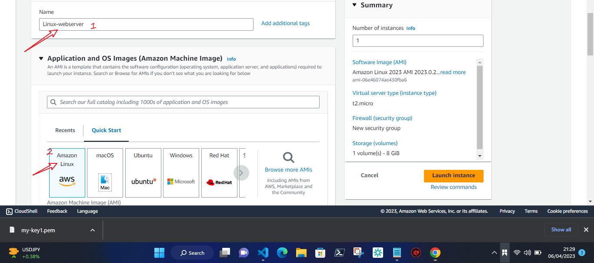

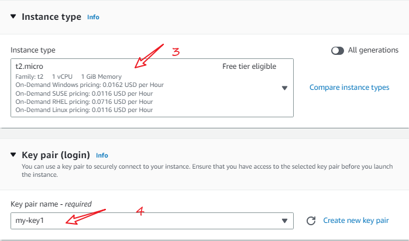


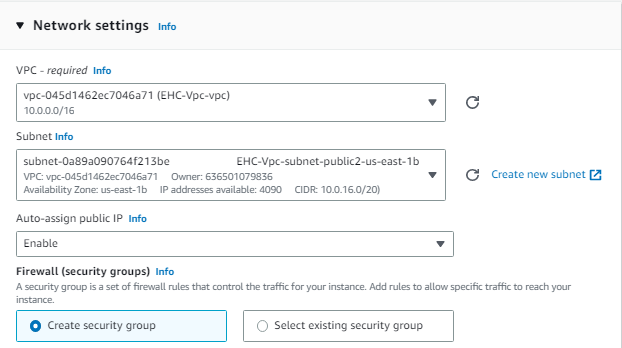

- Allow HTTP and HTTPS in inbound rule to connect to server

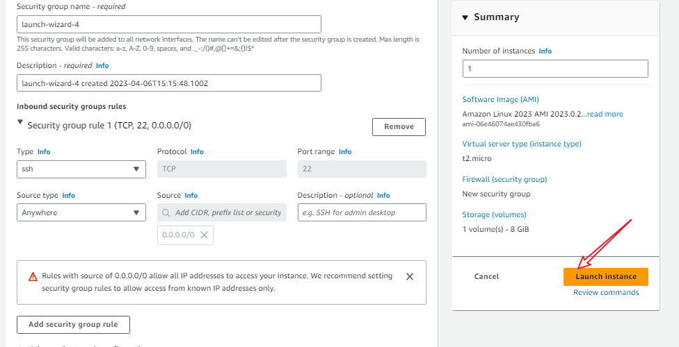

- Connect to the instance

```
ssh -i "my-key1.pem" ec2-user@ec2-54-91-59-170.compute-1.amazonaws.com

```

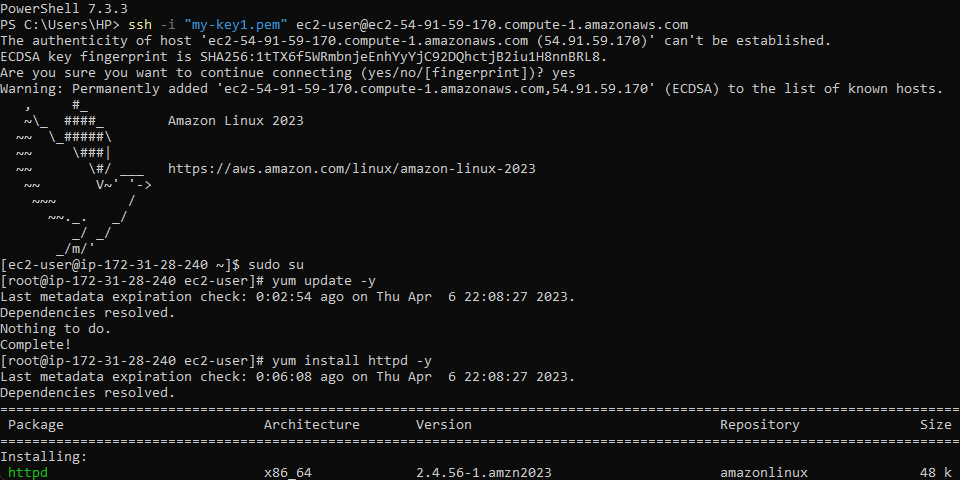

### Installing the Web Server:

- Elevate privileges

```
sudo su

```
- Update all of the packages on the instance

```
yum update -y

```
- Install Apache server

```
yum install httpd -y

```
- Start the webserver

```
service httpd start

```

- Check if the server is working (public ipv4 address)


### Add a static HTML file to be served

Add own custom web page.
By default, the apache web server will display the index.html file found in /var/www/html directory in the root path of the website.
In this section you will create an index.html file to be served.
Navigate to the directory mentioned above

```
cd /var/www/html

```
### Create an index.html file in this directory

```
nano index.html

```

- Add any html content to the file

```
<html><body>My webserver is running!!!😮</body></html>

```


### Task 3b:

- Windows Os

Execution:


- Click on Launch Instance

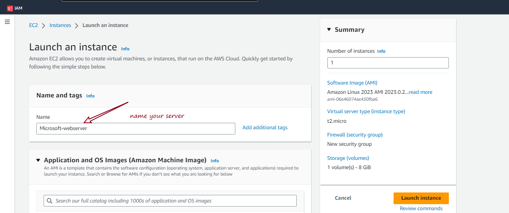

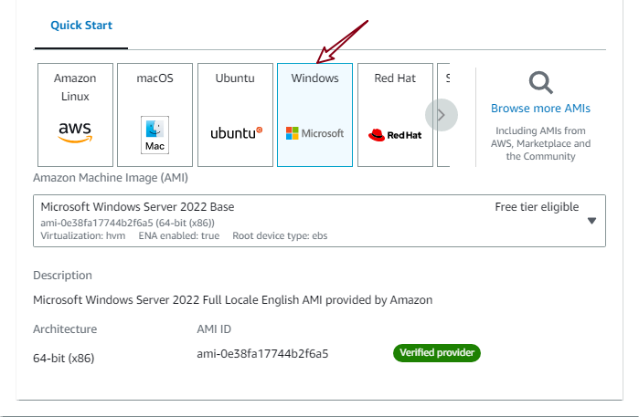

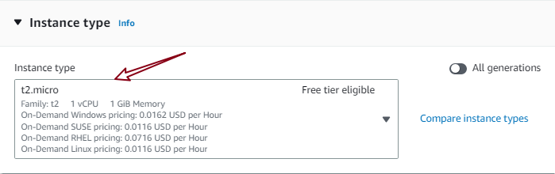

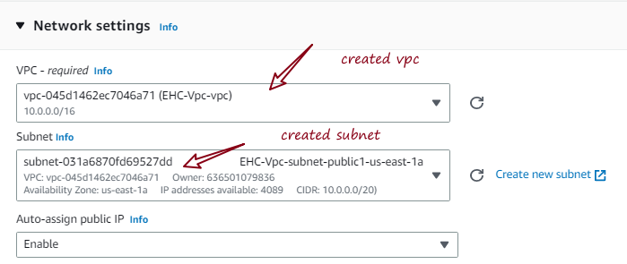

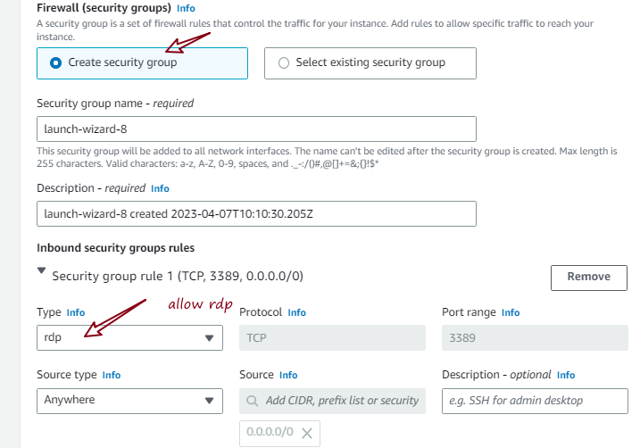

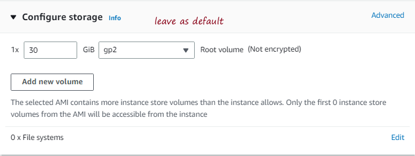

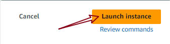

- Connect to WIndows server

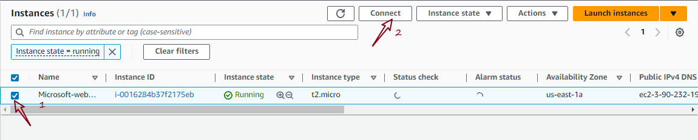

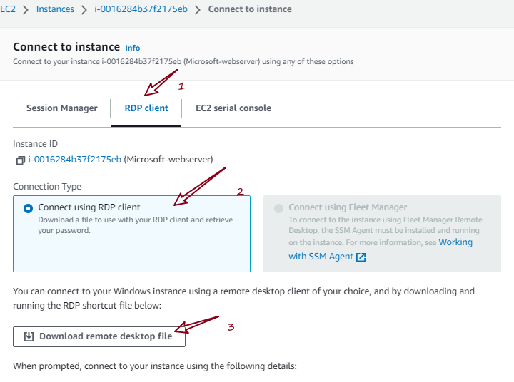

- Click on decrypt key. Upload the key pair you used to create the instance in my case my-key1

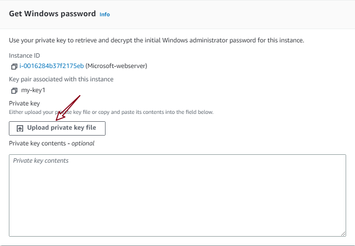

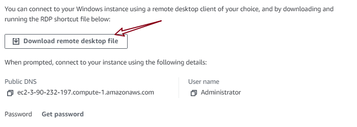

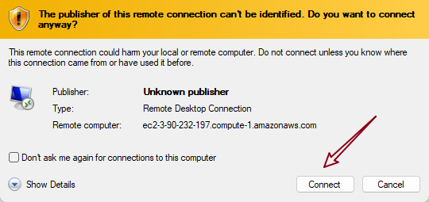

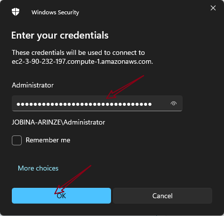

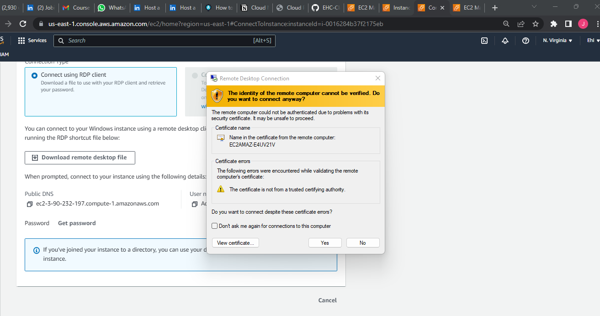

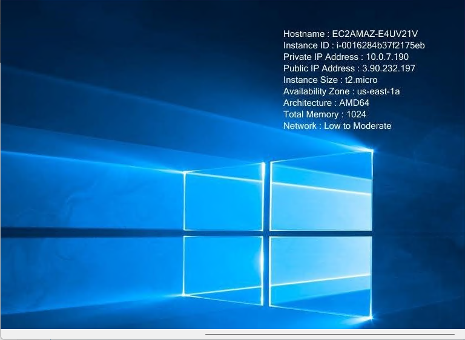


