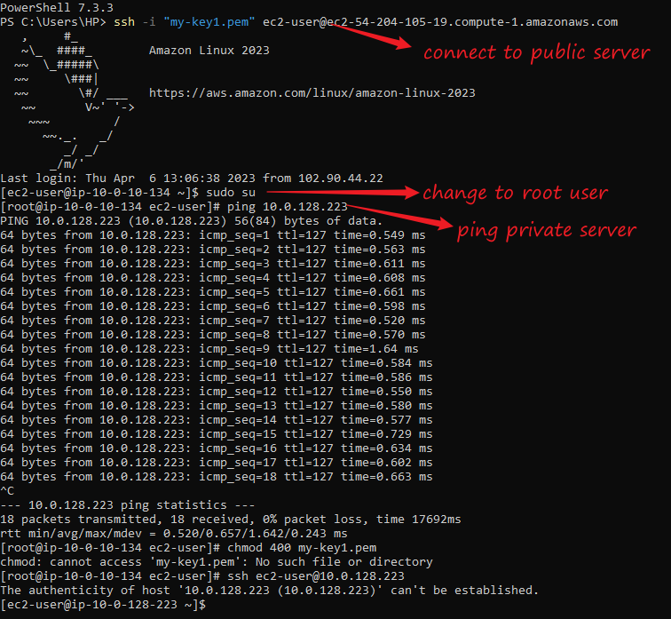

## Continuation of week 2:

[Cloud networking article](https://pattern-tortoise-b8c.notion.site/Cloud-Networking-3762e96211534350b25d8158b5d8a111)

### Task 1
- Create a Vpc on AWS

- create 6 subnets 3 private 3 public three availability zones

[Helpful video](https://youtu.be/ApGz8tpNLgo)

Execution:

- Log into the AWS console

- On the search bar type VPC

- Click into `Your VPCs`
 

Note that there is always a default VPC and subnets in every region in your AWS account.
- Create Vpc

This did not work for my overall configuration. so i created another vpc and clicked NAT GATEWAY was enabled
 (Adding this while configuring takes care of all the configurations for a NAT-Gateway)

### Task 2:

- Create Linux instances in  the private subnets.

-  Allow private subnet to download from internet ie set up Nat gateway for private subnet

Execution: Launch public webserver

Launch EC2 instance
- Search for Ec2 on the search bar

- Choose a name for webserver. Select Ami (Amazon linux as instructed)

- Choose  T2 micro because of free tier

- Create or Select a keypair

- Edit network Settings

- Choose the newly created vpc/subnet 

- Security group

- Launch instance

Tried to connect to the instance and got this error.(I had to launch a fresh instance with a new key ***my-key1***. ***My-key*** key pair was mistakenly deleted)

2. Create another webserver in the public subnet.

Follow same instructions as that of the private server but this time choose public subnets and security groups inbound rule should look like this.

- Connect to the Public server.

