Week 3 hands-on experience.

# PAAS

## Use Case: Elastic Beanstalk (AWS)

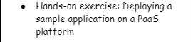

In this hands-on exercise, i used Elastic Beanstalk to deploy a web application to the cloud.
If you are following along, at the end of this lab, you will be able to deploy a web application to the cloud using Elastic Beanstalk.

Step 1. Access Elastic Beanstalk service from AWS Management Console:

- On the AWS Management Console page, select the Elastic Beanstalk service.

- Click on `create application`

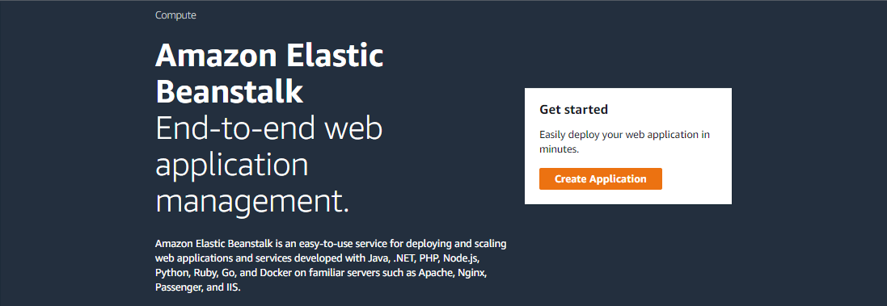

- Configure your application with the following details

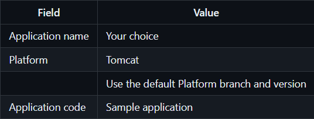

This configuration is meant to spin up an environment.

What is an environment?
An environment is the collection of AWS resources and permissions to allow your web application to run smoothly. The Elastic Beanstalk service manages the environment for you.

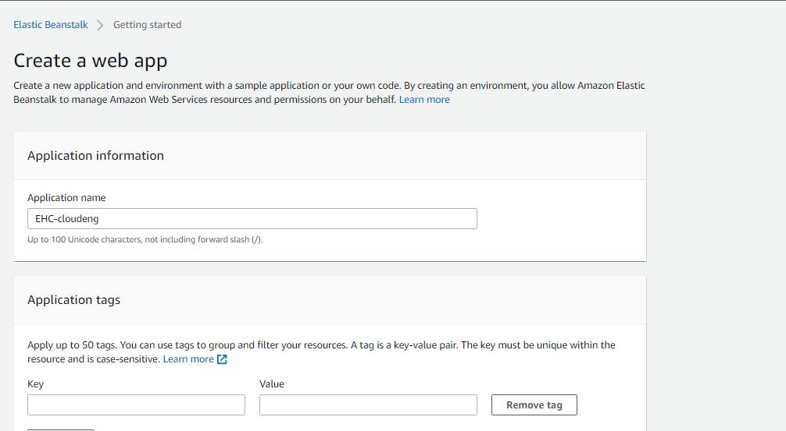

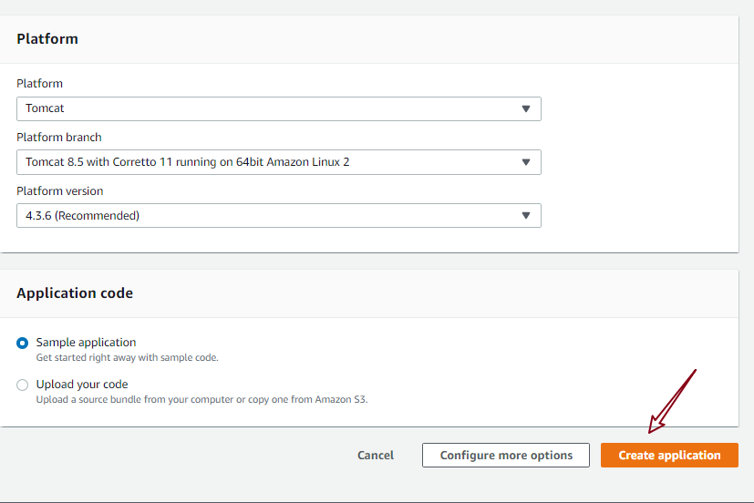

It is Important to Observe the logs shown on your dashboard to understand the resources that are being created to support your application. While launching the environment and deploying EC2 instances to run your application, the following resources get created automatically:

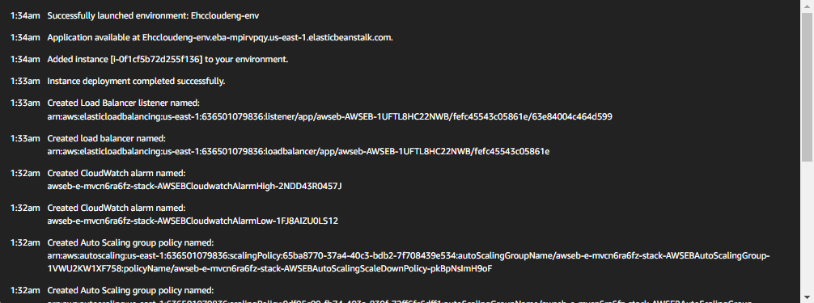

Your application is created once you see a green checkmark and the Health of your application as Ok.

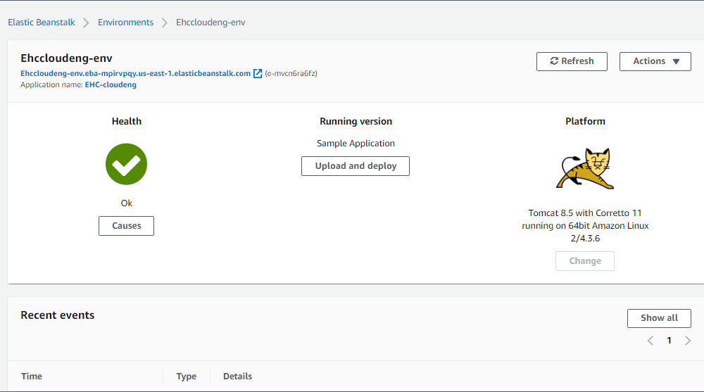

You can change the log-level to see more detailed information. The standard log-levels in any application are trace, debug, info, warn, error, and fatal.

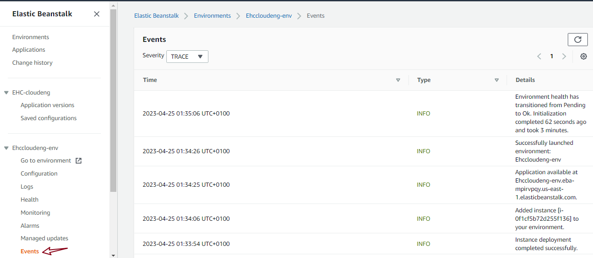

After the application is deployed successfully, copy the application’s URL that can be found against your application’s name, and paste it in a web browser.

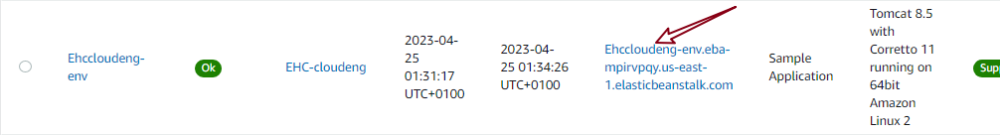

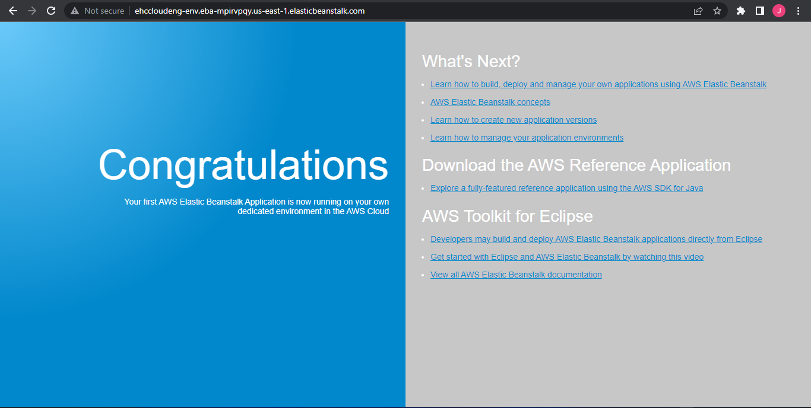

Step 2. Inspect the resources created:

Navigate to the EC2 console and inspect the instance that was created for you. The instance should have the same name as your application. You can administer and manage this EC2 as if you created it yourself.

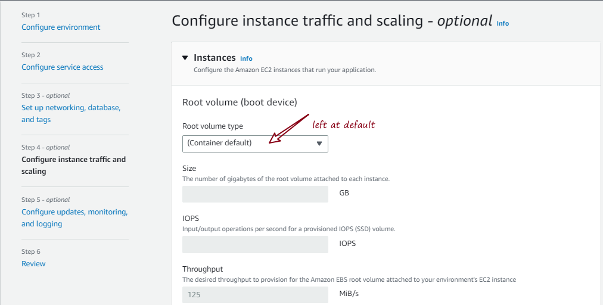

You can view the security groups (firewall rules) that was automatically created.

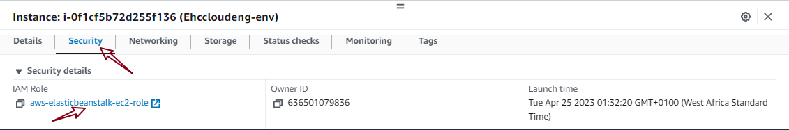

You can also navigate to the Amazon S3 service to view the S3 buckets created for the web application. All these resources are managed by the Elastic Beanstalk service.

Step 3. Cleanup and delete resources:

To clean up the resources to avoid recurring charges, you must delete your AWS resources.

Delete application: Go to the Elastic Beankstalk's Applications dashboard. Click on the Actions button in the upper right-hand corner, and click on `terminate application` to terminate your application componenents. Ideally, terminating the application will also delete the associated environment.
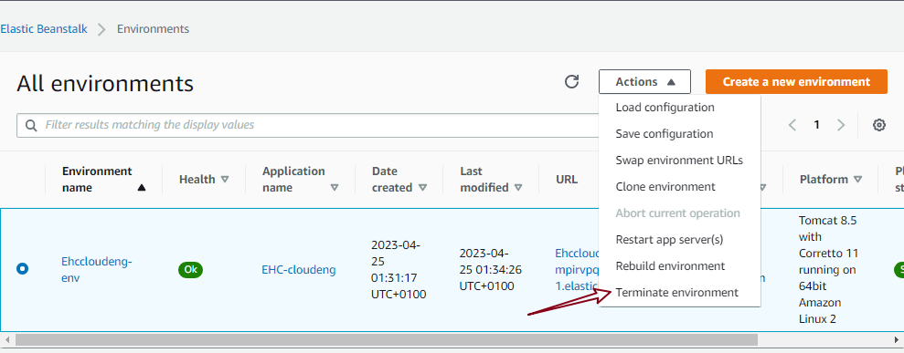

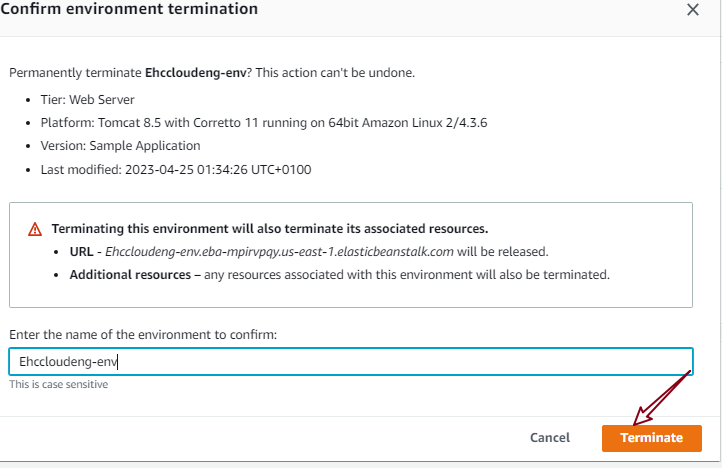

 However, you can navigate back to EC2, S3 to confirm. Note that you can also delete the application after a while. If you try to delete the application immediately, it will not work.

Visited S3 and the bucket was still there even after termination, so i emptied the bucket by clicking the `empty` option on S3. This emptied and automatically deleted the bucket.
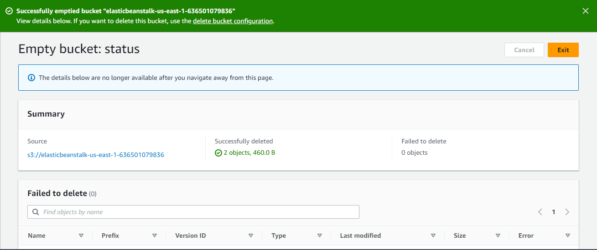

OOps bucket is still there. 

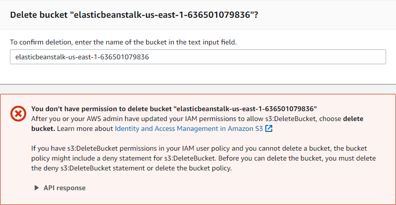

- The Ec2 instance has been terminated.

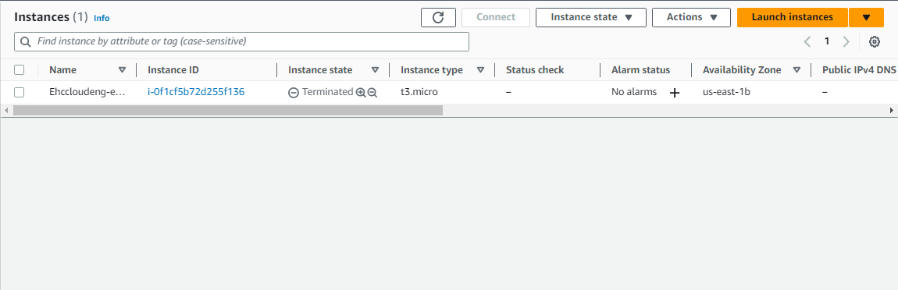

