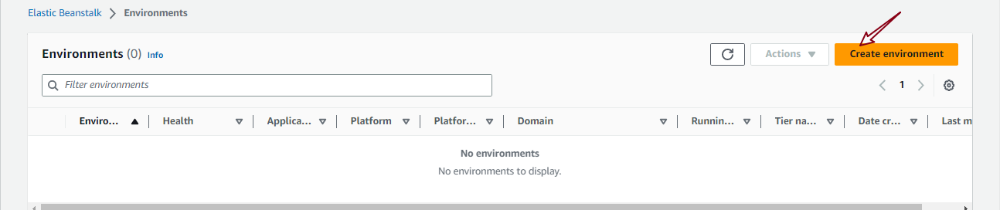

Week 3 hands-on experience.

# PAAS

## Use Case: Elastic Beanstalk (AWS)

In this hands-on exercise, i used Elastic Beanstalk to deploy a web application to the cloud.
If you are following along, at the end of this lab, you will be able to deploy a web application to the cloud using Elastic Beanstalk.

Step 1. Access Elastic Beanstalk service from AWS Management Console

- On the AWS Management Console page, select the Elastic Beanstalk service.

- Click on `create environment`

### Configure environment

- Click on next

### Configure service access

### Set up networking, database, and tags - optional

- I did not enable database

- Click on next

### Configure instance traffic and scaling - optional

### Configure updates, monitoring, and logging - optional
