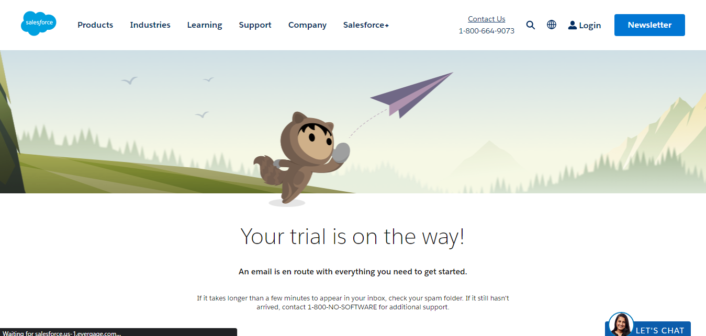

[Week 1](https://jobina.hashnode.dev/technical-bootcamp-30)

[week 2](https://github.com/Jobijollof/EHC-Cloud-Engineering-Cohort3/tree/main/Static-website-S3)

[week 2](https://github.com/Jobijollof/EHC-Cloud-Engineering-Cohort3/tree/main/Networking)

[week 3]()

Week 4 

# Software as a Service (SAAS)

Software as a Service, commonly known as SaaS, is a cloud computing service model that has become immensely popular in the  past few years.
In this cloud computing model, software applications are hosted by third party vendor. These software applications are made available to customers over the internet. This cloud computing model is subscription-based. Its pricing structure is one where users pay a fee monthly or annually to access the software.

### SAAS Providers

SaaS as acloud computing model, is such that the software is hosted on the cloud and can be  easily accessible by users from anywhere, at any time, and on any device as long as there is internet connection.  What this does is that it terminates the requirement for users to install and maintain software on their own computers, as all the maintenance and updates are handled by the service provider.

There are many SaaS providers in the market today, offering a wide range of software applications to businesses and individuals. Here are some examples of popular SaaS providers:

- Salesforce: provides cloud-based customer relationship management (CRM) software for businesses.

- Microsoft Office 365 - a cloud-based suite of productivity tools that includes Microsoft Word, Excel, PowerPoint, and more.

- Dropbox - offers cloud-based file storage and sharing solutions for businesses and individuals.

- Zoom - a video conferencing platform that enables remote collaboration and communication.

- Hubspot - provides a suite of marketing, sales, and customer service tools for businesses.

- Google Workspace (formerly G Suite) - a cloud-based suite of productivity tools that includes Gmail, Google Drive, Google Docs, and more.

- Slack - a team communication platform that enables real-time messaging and collaboration.

- Shopify - provides a cloud-based e-commerce platform for businesses to create and manage their online stores.

- Adobe Creative Cloud - a suite of creative tools for graphic design, video editing, and more.

- FreshBooks - offers cloud-based accounting and invoicing software for small businesses. 

### Advantages of saas

- Lower Costs: SaaS eliminates the need for businesses to purchase and maintain their own hardware and software. This means businesses can avoid upfront costs and ongoing maintenance expenses, making SaaS a more cost-effective option.

- Scalability: SaaS allows businesses to scale up or down as needed, depending on their changing requirements. This means businesses can easily add or remove users and applications as their needs evolve.

- Accessibility: SaaS is accessible from anywhere with an internet connection, making it easy for remote teams or employees to access applications and collaborate in real-time.

- Ease of Use: SaaS providers typically offer an intuitive user interface, making it easy for users to quickly get up and running with minimal training.

- Automatic Upgrades: SaaS providers typically handle all upgrades and maintenance, ensuring that the software is always up to date and secure.

- Integration: SaaS applications can often be easily integrated with other software applications, making it easier for businesses to manage their entire IT infrastructure from a single platform.

- Predictable Costs: SaaS providers typically offer subscription-based pricing, which allows businesses to predict their IT costs over time.

Overall, SaaS offers many benefits that make it an attractive option for businesses looking to streamline their IT operations and reduce costs. By outsourcing software development and maintenance to a third-party provider, businesses can focus on their core operations and achieve greater efficiency and productivity.

### Salesforece

Salesforce is an example of software as a service (SaaS) that provides customer relationship management (CRM) software.

Now, let me explain what that means. When a business wants to keep track of its interactions with its customers, it needs a way to store and manage all of the information about those interactions, such as contact information, purchase history, and customer support inquiries. That's where a CRM software like Salesforce comes in.

Salesforce provides a platform that allows businesses to manage their customer relationships in a streamlined way. They offer a variety of tools and features that allow businesses to track their sales, automate their marketing campaigns, and provide better customer service.

As a SaaS product, Salesforce is accessed through the internet and customers pay a subscription fee to use it. This means that businesses don't have to worry about buying and maintaining their own software, as Salesforce takes care of all of that for them. All the businesses need is an internet connection and they can access Salesforce from anywhere.

### Types of salesforce account

Salesforce offers different types of accounts based on the needs of the user. Here are some of the common types of accounts that you can open on Salesforce:

Personal account: This is a free account that allows individuals to use Salesforce for personal purposes or for learning purposes. It provides basic functionality, but is not intended for business use.

Developer account: This is a free account that allows developers to build and test applications on the Salesforce platform. It provides access to all of the platform's features and tools, and is designed specifically for app development and testing.

Professional account: This is a paid account that provides access to the core features of Salesforce, such as sales and customer service management, marketing automation, and analytics. It is designed for small to medium-sized businesses.

Enterprise account: This is a paid account that provides additional features and customization options beyond what is offered in the Professional account. It is designed for larger businesses with more complex needs.

Unlimited account: This is the highest level of paid account and provides access to all of the features and customization options that Salesforce has to offer. It is designed for large enterprises with complex needs and high volumes of data.

So, depending on your needs, you can choose the type of account that works best for you.

### Project: Open and document opening a Salesforce account

- Open [www.salesforce.com](http://www.salesforce.com/) 

- Click on login

- Click on ***salesforce**

