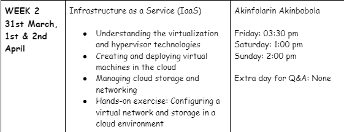

Week 1 started [here](https://jobina.hashnode.dev/technical-bootcamp-30)

Week 2:



We learnt that ***Virtualization*** is when we take one physical computer and create multiple "virtual" computers inside of it. Each virtual computer is like its own little world, with its own operating system, apps, and files. And just like with building blocks, we can create multiple virtual computers using the same physical computer, without having to buy more computers.

But how do we make sure that each virtual computer stays separate and doesn't interfere with the others? That's where a hypervisor comes in. Think of the hypervisor as a special kind of building block that helps us keep each virtual computer separate and running smoothly. It makes sure that each virtual computer gets its fair share of resources (like processing power and memory), and that they don't get mixed up with each other.

We learnt how to connect to a virtual machine ie EC2 instance(AWS)
We proceeded to learn about Storage and networking. We learned about:

- Amazon Simple Storage Service (S3): This is a scalable and durable object storage service that allows you to store and retrieve any amount of data from anywhere on the web.

- Amazon Elastic Block Store (EBS): This is a block-level storage service that is used for persistent storage of data for Amazon Elastic Compute Cloud (EC2) instances.

- Amazon Elastic File System (EFS): This is a file system service that provides scalable and highly available file storage for use with Amazon EC2 instances.

- Amazon Glacier: This is a low-cost, archival storage service that is designed for data that is infrequently accessed.

- AWS Storage Gateway: This is a hybrid storage service that allows you to seamlessly and securely integrate your on-premises storage infrastructure with the AWS Cloud.

- AWS Snowball: This is a physical data transport solution that helps you transfer large amounts of data into and out of AWS.

- AWS Snowmobile: This is a secure and efficient way to transfer exabytes of data to AWS using a 45-foot-long shipping container.

- Amazon FSx for Lustre: This is a high-performance file system that is optimized for compute-intensive workloads.

- Amazon FSx for Windows File Server: This is a fully managed Windows file system that is built on Microsoft Windows Server.

- Amazon EBS-backed Amazon Machine Images (AMIs): This is a way to store an EC2 instance as a reusable Amazon Machine Image (AMI) that you can use to launch new instances.

We were asked to set up a static website using S3

### Steps:

- Login to the AWS Console

- Search for S3 in the search bar

- Click on Create bucket


- Add Bucket name

- ACL disabled 


- Grant public Access


- Acknowledge that you are granting public access to the objects in the bucket.


- Leave everyother thing as default 

- Click on `Create bucket`


- Click into the created bucket

- Click on properties
 
 


- write your file name `index.html` and the error page you want (this is optional) `error.html`

- `Save Changes`


 
- Go to [tooplate.com](http://tooplate.com/) for free html templates.

- Upload files and folders


- Click on `Permissions`


- Edit `bucket policy` Add the following code.

```
{
    "Version": "2012-10-17",
    "Statement": [
        {
            "Sid": "PublicReadGetObject",
            "Effect": "Allow",
            "Principal": "*",
            "Action": [
                "s3:GetObject"
            ],
            "Resource": [
                "arn:aws:s3:::Bucket-Name/*"
            ]
        }
    ]
}

```
- Click on `save changes`

Kindly remember to edit with your own unique bucket name.

- Go to `properties` under `static website hosting`  Copy the URL and test on browser.


